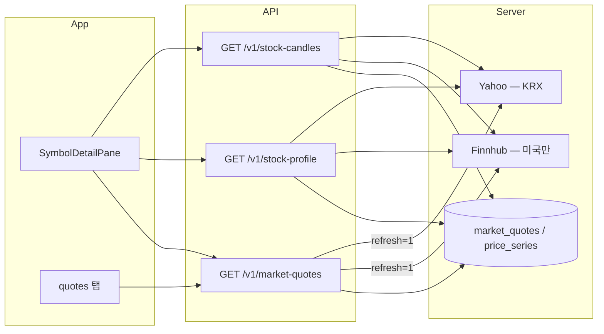

# 한국 종목(KRX) 시세·차트 데이터

국내 6자리 종목코드(`005930` 등)의 **시세·차트·프로필**이 비거나 부정확한 문제의 원인과 대응 방안입니다.

## 증상

| 화면 | 증상 |
|---|---|
| 종목 상세 | 현재가 `—`, 차트 없음, 회사명이 티커만 표시 |
| 시세 탭 관심종목 | `NO_SERVER_QUOTE` |
| 시총 | 국장은 UI에서 숨김(의도) |

공시(DART)·뉴스·외부 링크(네이버·토스)는 **별도 경로**로 동작하며, 위 증상과 무관합니다.

## 데이터 흐름



## 근본 원인

1. **Finnhub 단일 경로** — `server/src/providers/market/index.mjs`가 미국 티커만 지원. 6자리 코드는 `/quote`, `/stock/profile2`, `/stock/candle` 모두 실패.
2. **KRX 시세 Job 없음** — `market_quotes_*` Job은 `popular_symbols`, `default_watchlist` 등 **미국 리스트만** Finnhub로 수집.
3. **온디맨드 refresh 제외** — `/v1/market-quotes?refresh=1`에서 6자리 심볼을 provider fetch 대상에서 **명시적으로 제외**했음.
4. **일봉 Job에 국장 리스트 미포함** — `market_price_series_daily`의 `listKeys`에 `korea_watchlist`가 없어 차트용 `price_series`가 비어 있음.
5. **TossInvest 미연동** — `server/src/providers/tossinvest/market.mjs`는 KRX 시세·캔들 API를 갖추었으나 Job/HTTP에 연결되지 않음(OAuth 필요).

앱·DB 스키마(`krxSymbol`, `regularSession.yahooSymbol`)와 UI(KRW 포맷, 국내 링크)는 준비되어 있으나 **수집 파이프라인이 끊겨 있었습니다**.

## 적용한 대안 (Yahoo Finance)

API 키 없이 KRX를 지원하며, 이미 일봉·자동화 프록시에서 사용 중인 소스입니다.

| 항목 | 구현 |
|---|---|
| 시세 | `yahooKrx.mjs` → `005930.KS` / `.KQ` 폴백, `fetchYahooKrxMarketQuotes` |
| 프로필 | Yahoo chart `meta.longName` / `shortName` |
| 차트 | DB `price_series` 우선 → 없으면 Yahoo `period1`/`period2` 실시간 |
| 라우팅 | `market/index.mjs`에서 6자리는 Yahoo, 그 외는 Finnhub |
| refresh | `/v1/market-quotes?refresh=1`에 KRX 포함 |
| Job | `market_quotes_korea_watchlist` (yahoo, `korea_watchlist`) |
| 일봉 | `market_price_series_daily`에 `korea_watchlist` 추가 |

### 관련 파일

- `server/src/providers/market/yahooKrx.mjs` — KRX 전용 Yahoo 어댑터
- `server/src/providers/market/index.mjs` — 심볼 분기
- `server/src/http/public/v1/market.mjs` — refresh 필터 제거
- `server/src/jobs/runner.mjs` — `yahoo` + `market_quotes` 핸들러
- `server/db/migrations/postgres/V16__krx_market_data_yahoo.sql`

### 운영

1. 마이그레이션 적용 후 `market_quotes_korea_watchlist` Job이 5분 주기로 `korea_watchlist` 20종목 시세를 적재합니다.
2. `market_price_series_daily`가 동일 리스트 일봉을 저장해 차트 DB hit을 높입니다.
3. Admin **시장 일괄 실행** preset(`market_refresh`)에 국내 시세 Job이 포함됩니다.
4. 앱에서 `refresh=1` 시 KRX도 Yahoo로 즉시 갱신 가능합니다.

## 대안 비교 (향후)

| 대안 | 장점 | 단점 | 권장 시점 |
|---|---|---|---|
| **Yahoo (현재)** | 키 불필요, 구현 완료, 차트·시세 일원화 | 비공식 API, `.KS`/`.KQ` 수동 폴백, 약관 리스크 | **지금** |
| **TossInvest Open API** | 공식 국장 데이터, 종목명·경고 등 풍부 | Client ID/Secret·토큰 운영, rate limit | Yahoo 불안정 시 |
| **한국거래소/KRX 공식** | 가장 정확 | 유료·계약, 실시간 지연 정책 | 장기 |
| **네이버 금융 스크래핑** | 국내 사용자 친숙 | ToS·파싱 깨짐, 서버 부담 | 비권장 |
| **앱 직접 호출** | 서버 부하 감소 | AGENTS 원칙 위반(앱→외부 provider) | 비권장 |

### TossInvest 전환 시 체크리스트

- Admin `provider-settings/tossinvest`에 자격 증명 설정
- `fetchTossInvestPrices` / `fetchTossInvestStocks` / `fetchTossInvestCandles`를 `yahooKrx`와 동일한 `market_quotes` 행 형식으로 매핑
- Job provider를 `tossinvest`로 분기하거나 Yahoo 실패 시 폴백
- `server/scripts/testTossInvestProvider.mjs`로 스모크 테스트

## KOSDAQ(.KQ) 주의

6자리 코드만으로는 KOSPI/KOSDAQ 구분이 없습니다. Yahoo 조회는 **`.KS` → `.KQ` 순**으로 시도합니다. 로고(`services/symbolLogo.ts`)와 동일 전략입니다. `korea_watchlist`에 거래소 메타를 두면 정확도를 높일 수 있습니다(후속).

## 앱 측 (변경 없음)

- `isKoreaSymbol` / `isKoreaStockQuote` — 6자리 또는 `krxSymbol`로 KRW 표시
- `SymbolDetailPane` — 기존 API 그대로; 서버 데이터만 채워지면 표시됨
- 외부 링크 — 네이버·토스·구글 중심(이미 구현)

## 검증

```bash
# Yahoo KRX 스모크 (서버 디렉터리)
node --input-type=module -e "
import { fetchYahooKrxMarketQuotes, fetchYahooKrxStockProfile, fetchYahooKrxStockCandles } from './src/providers/market/yahooKrx.mjs';
const q = await fetchYahooKrxMarketQuotes({ symbols: ['005930'], segment: 'watch' });
const p = await fetchYahooKrxStockProfile('005930');
const to = Math.floor(Date.now()/1000);
const c = await fetchYahooKrxStockCandles('005930', { from: to - 30*86400, to });
console.log(JSON.stringify({ quote: q[0]?.currentPrice, profile: p?.name, candles: c?.t?.length }, null, 2));
"
```

배포 후 `005930` 종목 상세에서 현재가·차트·삼성전자 회사명이 보이면 정상입니다.
