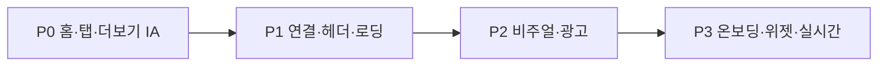

# SIGNAL 앱 UI/UX 평가 및 제안

코드·PRD([`SIGNAL-PRD.md`](./SIGNAL-PRD.md))·Toss 방향 문서([`SIGNAL-TOSS-UIUX-PMD.md`](./SIGNAL-TOSS-UIUX-PMD.md)) 기준으로 정리한다. **제품 방향은 “오늘 뭘 봐야 하지?”에 맞게 잡혀 있는데, 화면 구조는 아직 “여러 피드를 탐색하는 앱”에 가깝다.**

작업 상태·단계별 체크리스트는 [`SIGNAL-UIUX-REVIEW.md`](./SIGNAL-UIUX-REVIEW.md)를 참고한다.

---

## 총평 (7 / 10)

| 영역 | 점수 | 한 줄 요약 |
|------|------|------------|
| 비주얼 일관성 | 8 | 라이트/다크 토큰, 세그먼트 탭, 그룹 카드가 잘 맞춰져 있음 |
| 정보 구조(IA) | 5 | 탭 5개 + 헤더 아이콘 + 홈/뉴스/브리핑 역할이 겹침 |
| 첫 5초 경험 | 6 | 홈이 있지만 탭·첫 화면 설정이 뉴스 습관을 강화할 수 있음 |
| 피드·목록 UX | 7 | 읽기 흐름은 좋고, FAB·광고·로딩이 방해할 때 있음 |
| 설정·고급 기능 | 6 | 강력하지만 일반 사용자에게는 과밀 |
| 접근성·다국어 | 8 | 로케일·a11y 라벨이 광범위하게 들어가 있음 |

**강점:** Signal API 단일 데이터 경로, `SignalHeader`·`groupedFeedList`·세그먼트 탭 등 컴포넌트 재사용이 잘 되어 있고, 필터 시트·홈 병렬 로드·시세 캐시 등 체감 성능을 의식한 개선이 이어지고 있다.

**약점:** PRD/PMD가 말하는 “개인화된 시장 체크 앱”으로 보이려면, 뉴스·유튜브·시세·홈이 동급 탭이면 사용자가 “어디부터 볼지”를 스스로 정해야 한다.

---

## 잘 된 점

### 1. 디자인 시스템 기반

`constants/theme.ts`에 라이트 퍼스트 토큰과 다크 대응, 사용자 액센트 색이 있다. Toss PMD와 방향이 맞다.

### 2. 피드 패턴의 일관성

뉴스·유튜브·시세가 상단 고정 세그먼트 + 그룹 카드 + 당겨서 새로고침으로 통일되어, 탭을 옮겨도 학습 비용이 낮다.

### 3. 홈의 제품 의도

홈(`app/(tabs)/index`)은 인사이트·관심 시세·관련 뉴스/영상을 묶어 “요약 → 근거” 구조로 가고 있다. CHANGELOG·PRD와 일치하는 방향이다.

### 4. 최근 UX 개선 방향

- 필터: 완료 한 번으로 적용 (적용/닫기 중복 제거)
- 시세: 짧은 주기 자동 폴링 대신 passive cache + 수동 갱신
- 빈 상태 문구를 제품 맥락에 맞게 정리하는 흐름

### 5. 실행 문서

`SIGNAL-TOSS-UIUX-PMD.md`에 IA·홈·탭 개편안이 이미 있다. “무엇을 고칠지”는 팀 안에 합의가 있는 상태이며, 남은 것은 우선순위와 점진 적용이다.

---

## 아쉬운 점 (구체)

### 1. 정보 구조 — 가장 큰 갭

평가 당시 하단 탭: **뉴스 · 시세 · 홈 · 유튜브 · 더보기** (5개).

- **홈**이 “매일 여는 이유”인데, 탭 순서·`mainEntryPreference`로 뉴스 첫 진입도 가능하다.
- 관심 브리핑·컨콜·오늘의 시그널 전체는 스택 화면이라, 더보기 탭은 설정 중심이고 핵심 기능은 헤더(알림·캘린더·계정)에 분산될 수 있다.
- 오늘의 시그널이 뉴스 탭 상단 + 홈 + 인사이트 화면에 나뉘어, 신규 사용자에게는 “같은 건가, 다른 건가?”가 헷갈릴 수 있다.

### 2. 헤더·FAB 밀도

모든 탭에 `SignalHeader`(로고 + 태그라인 + 아이콘)가 붙고, 피드에는 새로고침 FAB + 필터 FAB가 겹칠 수 있다.

- 로고 탭 = 새로고침은 발견하기 어렵다 (첫 실행 힌트 부재).
- FAB 2개 + 플로팅 글래스 탭바는 브랜드는 살지만, Toss식 “조용한 금융 UI”와는 거리가 있다.

### 3. “탐색” vs “체크” 목적 혼재

| 화면 | 적합한 목적 | 현재 느낌 |
|------|-------------|-----------|
| 뉴스·유튜브 | 긴 시간 탐색 | 적합 |
| 시세 | 빠른 가격 확인 | 적합 |
| 홈 | 30초 체크 | 내용은 맞으나 탭 경쟁 |
| 브리핑·종목 상세 | 깊은 분석 | 정보는 풍부, 진입 경로가 약할 수 있음 |

### 4. 설정·더보기

설정은 옵션이 많다. 파워 유저에게는 좋지만 출시 초기에는 인지 부하가 클 수 있다.

더보기는 허브 역할을 PRD에서 기대하지만, 설정 + 참고 링크 + 광고 중심이면 “SIGNAL의 나머지”가 비어 보일 수 있다.

### 5. 콘텐츠·수익화와 읽기 흐름

피드 중간 광고는 이해 가능하지만, 투자 판단 읽기 흐름과는 충돌할 수 있다. PMD의 “노이즈 최소화”와도 긴장 관계다.

---

## 개선 제안 (우선순위)

### P0 — 제품 정체성 (2~4주, PMD와 동일 축)

**① 탭을 “습관 1개”로 재정렬**

권장 구조 (PMD와 동일):

| 탭 | 역할 |
|----|------|
| **홈** | 오늘 시장 온도 · 볼 종목 3 · 브리핑 요약 · 근거(뉴스/영상/일정) |
| **뉴스** | 글로벌/한국/코인 피드만 |
| **시세** | 관심·인기·시총·코인 |
| **더보기** | 유튜브, 캘린더, 컨콜, 브리핑, 설정, 계정 |

- **유튜브를 탭에서 내리고** 홈 “근거” 또는 더보기 1depth로 — 매일 핵심이 아니면 탭 점유가 아깝다.
- **기본 `initialRouteName`·첫 화면 설정 기본값 = 홈**을 우선하고, 뉴스 첫 진입은 고급 설정으로 둔다.

**② 더보기 허브 복원**

카드 리스트 예시:

- 오늘의 시그널 (전체)
- 관심 브리핑
- 경제 캘린더 / 컨콜
- 유튜브 (또는 홈에서만 미리보기)

→ 헤더 아이콘 의존도를 줄이고 기능 발견성을 올린다.

**③ 홈을 “한 문장 + 3 pill + 카드”로 압축**

1. 상단 한 줄: “오늘 시장은 ~”
2. pill 2~3개: 시장 온도 / 주의 종목 수 / 오늘 일정
3. **오늘 볼 종목** 3개 (탭하면 종목 상세)
4. **근거** 한 줄 칩: 뉴스 | 유튜브 | 일정

뉴스 탭 상단의 큰 인사이트 카드는 접거나 홈으로만 노출해 중복을 줄인다.

---

### P1 — 상호 연결·피드 UX (1~2주)

**④ 카드에서 맥락 점프**

- 뉴스 카드의 티커/해시태그 → 종목 상세
- 시세 행 → 브리핑 해당 종목 섹션 또는 상세
- 홈 근거 행 → 해당 탭 필터 적용된 상태로 deep link

**⑤ 헤더·FAB 정리**

- 비홈 탭: 태그라인 숨기거나 한 줄로 축소
- 새로고침: FAB 1개 또는 당겨서 새로고침만 (필터는 유지)
- 새로고침 성공 시 짧은 토스트: “방금 업데이트됨”

**⑥ 로딩·빈 상태 통일**

- 탭 전체 스피너 vs 인라인 로딩 → 섹션 단위 스켈레톤으로 통일
- 빈 상태는 API/쿼터가 아니라 **다음 행동**(채널 추가, 관심종목 설정, 새로고침) 중심

**⑦ 설정 2단**

- **기본**: 테마, 알림, 언어, 관심종목
- **고급**: 서버 endpoint, 캐시, 탭 순서, 탭바 투명도

---

### P2 — 비주얼·브랜드 (중기)

**⑧ 탭바: 글래스 → 라이트 솔리드 옵션**

PMD대로 blur/glass를 줄이고, 라이트 배경 + 얇은 보더. 다크 모드는 유지하되 금융 앱 가독성 우선.

**⑨ 타이포·터치 스케일 고정**

- 본문 14–16, 주요 버튼 높이 48–52
- `scaleFont`는 본문에만, 버튼/탭 라벨은 최소 크기 보장

**⑩ 광고 배치**

- 피드: N개당 1개 → 섹션 끝 1블록
- 또는 더보기/비로그인 구간에만 집중

---

### P3 — 장기 (차별화)

- 온보딩: 관심종목 3~5개 + 알림 on + 홈 미리보기 1화면
- 위젯 / Live Activity: 관심 종목 1~3개 변동
- 푸시 → 홈 특정 종목 deep link
- 시세 실시간은 WebSocket/SSE

---

## 반영 상태

이번 평가에서 바로 반영한 항목:

- 하단 탭을 **홈 · 뉴스 · 시세 · 더보기** 4개로 단순화했다.
- 유튜브는 하단 탭에서 내리고, 더보기 허브에서 진입하게 했다.
- 첫 화면 설정 후보는 홈 우선 흐름에 맞춰 홈/뉴스/시세/더보기로 정리했다.
- 더보기 허브에 오늘의 시그널, 관심 브리핑, 캘린더, 컨콜, 유튜브, 내정보, 설정을 배치했다.
- 뉴스·시세·유튜브·더보기는 compact 헤더를 사용해 목록 화면의 세로 밀도를 낮췄다.
- 홈은 관심종목 변화를 먼저 보여주는 Watchlist Pulse 흐름으로 바꾸고, 가격·등락·관련뉴스 수·시그널 수를 카드 전면에 배치했다.

아직 남겨둔 항목:

- 홈의 관심종목 ranking을 `큰 변동`, `뉴스 집중`, `실적 임박`, `시그널 연결` 기준으로 더 정교화하는 작업.
- 카드 간 deep link 맥락 전달(뉴스 티커 → 종목 상세, 홈 근거 → 필터 적용 목록).
- 광고 위치와 탭바 glass 강도 조정.
- 온보딩, 위젯, 실시간 시세 같은 중장기 기능.

## PMD 문서와의 관계

`SIGNAL-TOSS-UIUX-PMD.md`의 제안과 위 내용은 거의 같다. 이미 코드에 있는 것:

- 라이트 토큰 (`SIGNAL_LIGHT`)
- 홈 요약 구조 (진행 중)
- 시세 row 레이아웃, 필터 지연 적용

아직 덜 반영된 것:

- 홈 관심종목 ranking의 추가 정교화
- 라이트 탭바·광고 톤 다운
- 인사이트 노출 위치의 완전한 통합

→ 새 방향을 짤 필요보다, **PMD를 Phase로 나눠 실행**하는 편이 효율적이다.

---

## 추천 로드맵 (실행 순서)

1. 홈 기본 탭 + 더보기 허브 채우기 (가장 체감 큼)
2. 뉴스 탭 인사이트 중복 제거 + deep link
3. 헤더/FAB/설정 단순화
4. 탭바·광고 톤 다운

---

## 문서 인덱스

루트 [`AGENTS.md`](../AGENTS.md) 문서 테이블에 본 파일이 등록되어 있다.
